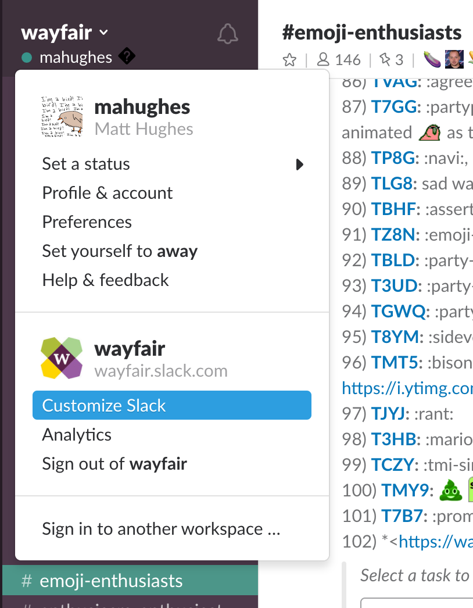
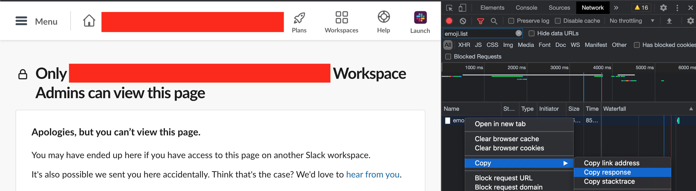
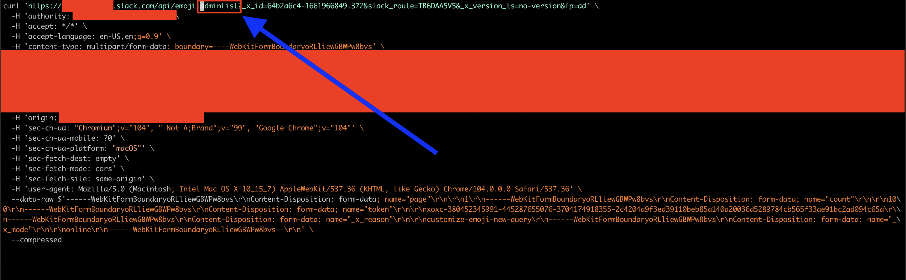
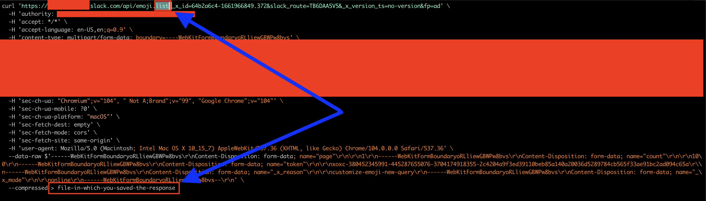
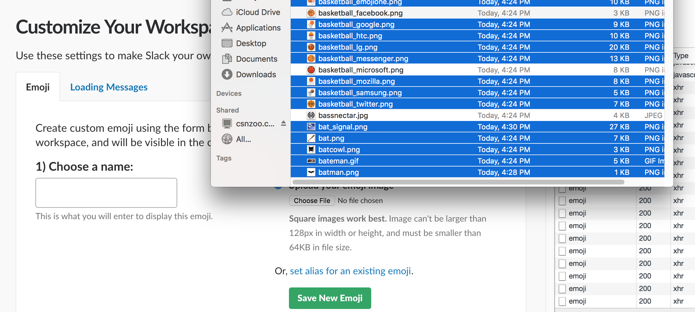

# Emojisplosion!

This is a holding pen for my slack emoji-related manipulation
scripts. I use Imagemagick for most of them, and often use the
spectacular
scripts [gif2anim](http://www.imagemagick.org/Usage/scripts/gif2anim)
and [anim2gif](http://www.imagemagick.org/Usage/scripts/anim2gif) for
manipulating/optimizing gifs frame-by-frame.

## Bulk Emoji Upload/Download

One can mass-download and mass-upload emoji from/to organizations you
have access to, using the download-emoji.sh and upload-emoji.js
scripts. This is particularly useful for when one organization has
generated a large number of emoji you consistently find yourself
reaching for. Now you can have them everywhere you use slack!

### Emoji Download

You'll need :
- [`jq`](https://stedolan.github.io/jq/),
- `wget`,
- a passing familiarity with the "Network" tab of Chrome Dev Tools
  Tools

From slack, navigate to your org's customize/emoji page.


If that option isn't present, don't despair! You can still download
emoji from a slack workspace which is set up to disallow non-admins
from customizing emoji. Add `/customize/emoji` to the end of the url
that appears below your org's name.

Open developer tools to the Network tab, reloading the page if necessary to populate it with requests.
Search for `emoji.list` and copy the response for the corresponding request, saving it in some file.


If the emoji.list request isn't in the Network tab, search instead for
`emoji.adminList`, and use "copy as cURL". Then edit the URL to which
this request is made, substituting `emoji.list` wherever you find
`emoji.adminList`. (The motivation for this is that the new URL is
paginated, so we want to use the older, unpaginated endpoint to get
the emoji list.) You can pipe the output from that command into a json
file like so:


You'll want to edit that specific part to read `emoji.list`, as well
as add a `>` and a filename to the end of the (rather long) `curl`
command, these last of which save the output to a file. After doing so
it should look like this:


On the command line, navigate to the directory to which you'd like to download all emoji and invoke the script
```sh
mkdir i-recommend-you-use-a-clean-directory
cd !$ # go there^
path/to/download-emoji.sh file-in-which-you-saved-the-response
```

The download is quite likely to take a solid amount of time, (usually a few minutes on my macbook).

### Emoji Upload

Now that you have a zillion (ahem) emoji on your computer, you can
upload them to other organizations of which you're a part! You can be
the Prime Minister of emoji in every slack you join!

Navigate to the customize/emoji page of the organization to which
you'd like to upload emoji. (See
the [Emoji Download section](#emoji-download) for how to access this
page.) Copy and paste the whole contents
of [the upload-emoji.js script](upload-emoji.js) into the javascript
console of Chrome Dev Tools, and execute it. You can now drag-and-drop
single or groups of files onto the "Choose a name" field, and they'll
be uploaded to that organization.




# License

[Creative Commons Attr./Share-Alike](https://creativecommons.org/licenses/by-sa/3.0/deed.en)
