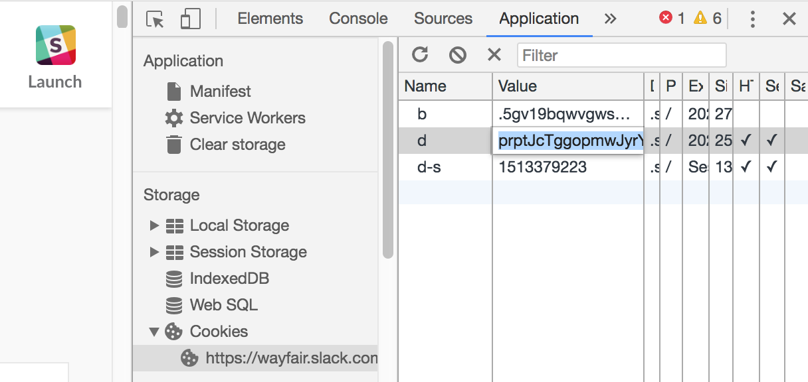

# Emojisplosion!

This is a holding pen for my slack emoji-related manipulation
scripts. I use Imagemagick for most of them, and often use the
spectacular
scripts [gif2anim](http://www.imagemagick.org/Usage/scripts/gif2anim)
and [anim2gif](http://www.imagemagick.org/Usage/scripts/anim2gif) for
manipulating/optimizing gifs frame-by-frame.

## Bulk Emoji Upload/Download

One can mass-download and mass-upload emoji from/to organizations you
have access to, using the download-emoji.sh and upload-emoji.js
scripts. This is particularly useful for when one organization has
generated a large number of emoji you consistently find yourself
reaching for. Now you can have them everywhere you use slack!

### Emoji Download

You'll need :
- [`pup`](https://github.com/ericchiang/pup),
- `wget`,
- `perl`,
- Either
  - a browser extension for inspecting browser cookies
    (e.g. [EditThisCookie](http://www.editthiscookie.com/)), or
  - a passing familiarity with the "Application" tab of Chrome Dev
    Tools

From slack, navigate to your org's customize/emoji page.


Grab the organization's name from the URL.


Extract the `d` cookie which authorizes you to view this page.


On the command line, navigate to the directory to which you'd like to download all emoji and invoke the script
```sh
mkdir i-recommend-you-use-a-clean-directory
cd !$ # go there^
path/to/download-emoji.sh "paste_the_d_cookie_here" "paste_your_organization_name_here"
```

The download is quite likely to take a solid amount of time, (usually a few minutes on my macbook).

### Emoji Upload

Now that you have a zillion (ahem) emoji on your computer, you can
upload them to other organizations of which you're a part! You can be
the Prime Minister of emoji in every slack you join!

Navigate to the customize/emoji page of the organization to which
you'd like to upload emoji. (See
the [Emoji Download section](#emoji-download) for how to access this
page.) Copy and paste the whole contents
of [the upload-emoji.js script](upload-emoji.js) into the javascript
console of Chrome Dev Tools, and execute it. You can now drag-and-drop
single or groups of files onto the "Choose a name" field, and they'll
be uploaded to that organization.


# License

[Creative Commons Attr./Share-Alike](https://creativecommons.org/licenses/by-sa/3.0/deed.en)
